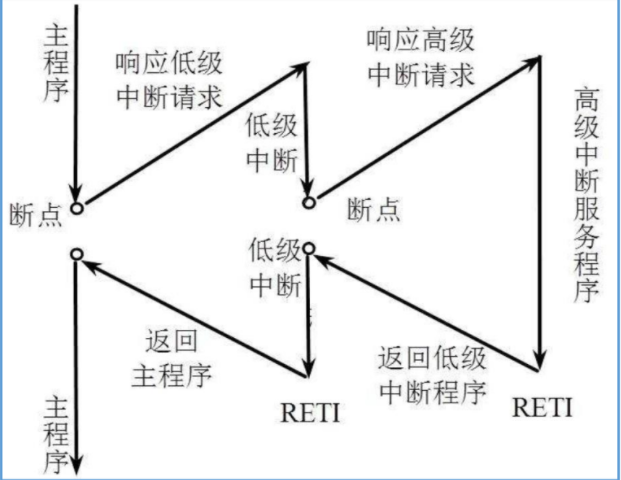

### 中断使用教程
一、基本概念
 - 中断是处理器中的一种机制，用于响应和处理突发事件或紧急事件。当发生中断时，当前正在执行的程序会被暂时中止，处理器会跳转到中断处理程序（也称为中断服务例程），对中断事件进行处理。处理完中断后，处理器再返回到被中断的程序继续执行。
 - 中断可以分为内部中断和外部中断：
    1. 内部中断：由处理器内部的模块或事件引发，例如定时器溢出、串口接收缓冲区非空等。内部中断可以用于定期执行特定任务、检测状态变化等。
    2. 外部中断：由外部设备或外部信号引发，例如按键按下、外部传感器信号变化等。外部中断用于响应外部事件，并及时处理相关任务。

二、 中断响应过程
 1. 中断源发出中断请求
 2. 判断处理器是否允许中断，以及该中断源是否被屏蔽
 3. 中断优先级排队
 4. 处理器暂停当前程序，保护断点地址和处理器的当前状态，根据中断类型号，查找中断向量表，转到对应的中断服务程序
 5. 执行中断服务程序
 6. 恢复被保护的状态，执行中断返回指令，回到被中断的程序
   
三、 中断优先级
 

四、中断开启步骤
 1. RCC内部时钟
 2. 选择内部模式 
 3. 运行控住
 4. 终端控制输出
 5. NVIC（中断优先级）